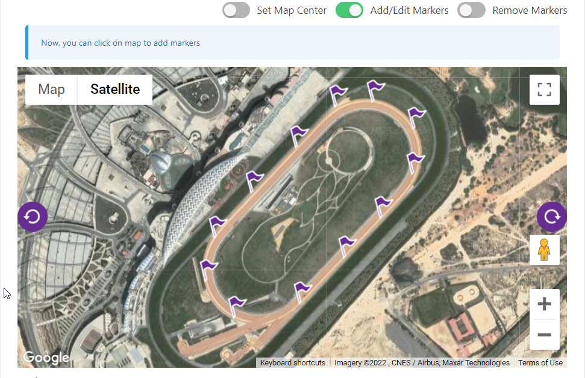
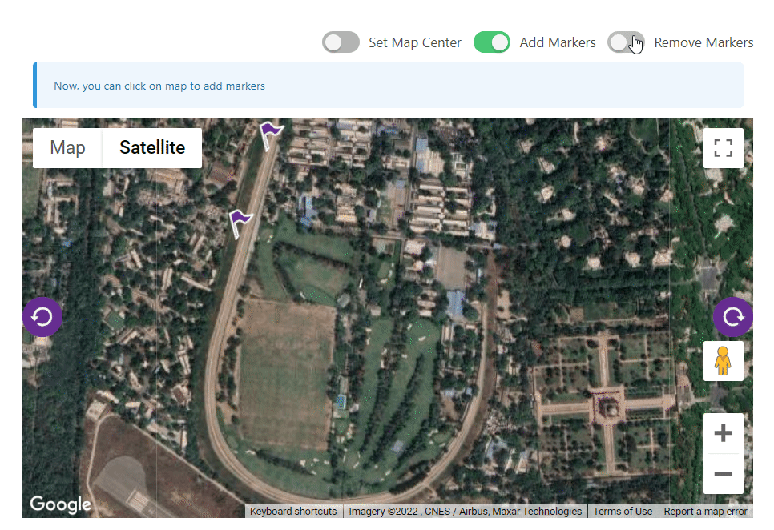
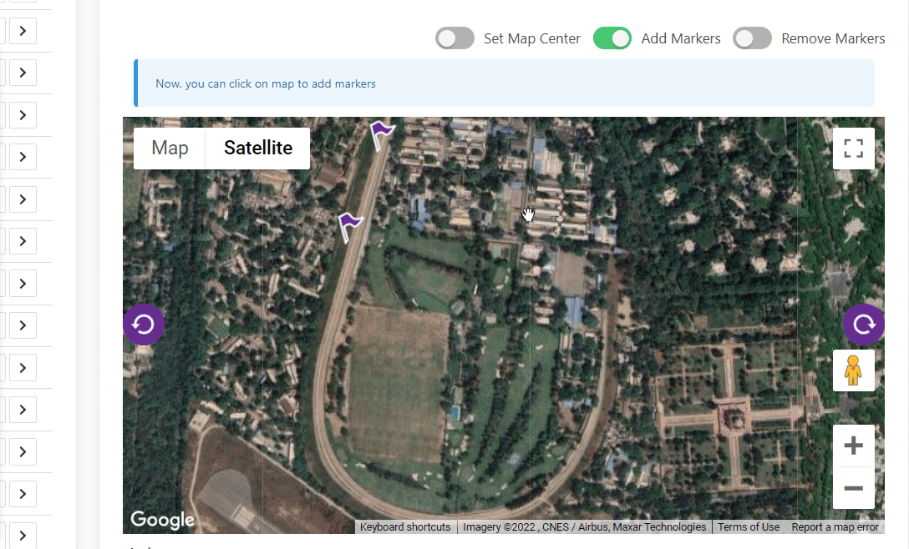
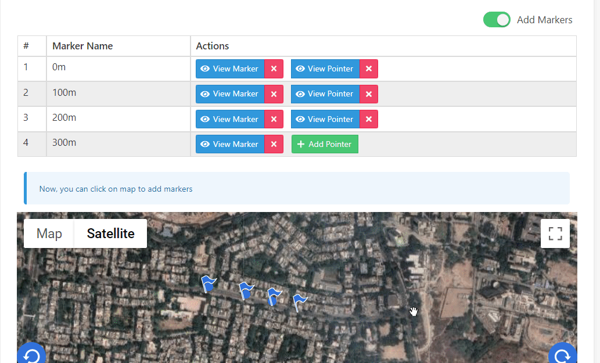

# GoogleMapMarker
> Reusable Component


### Introduction



GoogleMapMarker allows for quick integration of Google Maps and Google Map Markers to your project, while providing controls for other features such as
   
  * ##### Setting new locations as center: 
    Navigate the click on the map to set latitude and longitude as center of the map (pan is added by default)
    

  * ##### Adding Markers 
    When add marker toggle is on, you can add markers by clicking on any location
    

  * ##### Removing Markers
    Remove marker easily from the list
    

 
  * ##### Setting Custom Marker Icon
    You can customise the icon image easily
  
  * #### Naming/Renaming Markers
    Name/Rename Markers easily
    
    
  * #### Adding Pointers
    Add pointer against any marker with ease
    
    
  * #### Removing Pointers
    Remove pointer with ease
    

    
  * #### Adding Rotation Controls
    Support for adding rotation buttons and for updation of icons
    

    
  * #### Zoom Control
    Native support for zoom

---

### Dependencies
- [vue2-google-maps](https://github.com/xkjyeah/vue-google-maps)

---


### Implementation

```vue
    <google-map 
        :latitude="new_item.latitude"
        :longitude="new_item.longitude"
        :image_url="root.image_url"
        marker_icon="marker_icon.png"
        rotate_left_icon="rotateleft.png"
        rotate_right_icon="rotateright.png"
    />
```

#### Provide API

The parent component must provide the following properties using Provide/Inject API in Vue

```vue
    data(){
        return {
            markers: [],
        }
    },
    provide(){
        return {
            markers: this.markers,
            image_url: this.root.image_url
        }
    },
```
---

### Properties

| Name        | Description            | Type           | Values   | Default
| -----------:|:----------------------:| --------------:|---------:|:------------
| latitude    | latitude of the center | String,Number  | -        | -
| longitude   | latitude of the center | String,Number  | -        | -
| longitude   | latitude of the center | String,Number  | -        | -
| zoom        | zoom level of the map  | String,Number  | -        | 16
| custom_style| css style of the map (Must have width and height) | String  | -        | 'width:100%;  height: 400px;'
| image_url | url for image location | String  | -        | -
| marker_icon | name of marker image | String  | -        | -
| rotate_left_icon | name of rotate left button image | String  | -        | -
| rotate_right_icon | name of rotate right button image | String  | -        | -
| map_type_id | type of map | String  | 'roadmap','satellite', 'hybrid', 'terrain'       | 'satellite'
| show_controls | shows map controls | Boolean  | -    | true
| is_rotatable | shows rotate controls | Boolean  | -    | true
| heading | angle of rotation | String,Number  | -    | 0
| tilt | tilt of map | String,Number  | -    | 0
| is_edit_ready | sets add marker default to true and changes its switch label to edit | Boolean  | -    | false
---
